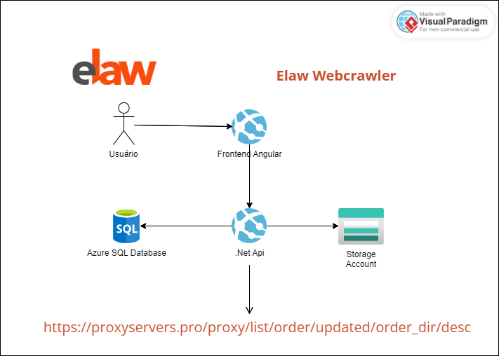
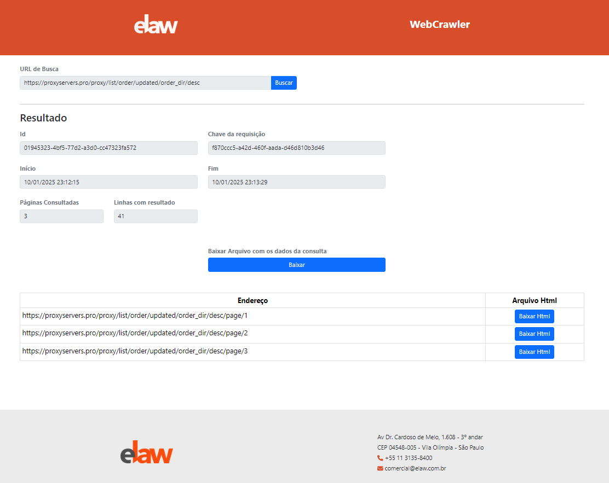

# elaw_webcrawler

Criar ferramenta para extração dos dados de website (Webcrawler).

## Requisitos

<ol>
<li>Acessar o site "https://proxyservers.pro/proxy/list/order/updated/order_dir/desc".</li>
<li>Extrair os campos "IP Adress", "Port", "Country" e "Protocol". de todas as linhas, de todas as páginas disponíveis na execução.</li>
<li>Necessário salvar o resultado da extração em arquivo json, que deverá ser salvo na máquina.</li>
<li>Necessário salvar em banco de dados a data início execução, data termino execução, quantidade de páginas, quantidade linhas extraídas em todas as páginas e arquivo json gerado.</li>
<li>Necessário print (arquivo .html) de cada página.</li>
<li>Necessário que o webcrawler seja multithread, com máximo de 3 execuções simultâneas.</li>
</ol>

## Idealização do Projeto



O diagrama acima mostra a idealização do projeto.

Foram separados contextos para separar as responsabilidades de cada ação.

O **Frontend Angular** exibe uma interface amigável para realizar e visualizar os dados da requisição com ações para baixar os arquivos json e html.

O **Backend .Net** faz toda a orquestração de busca de dados no site proxyservers e tratamento dos dados para armazenamento e resposta para o cliente.

O **Azure SQL Database** armazena os dados das requisições e os links onde estão armazenados no **Storage Account**.

O **Azure Storage Account** armazena os arquivos **html** das páginas consultadas e os arquivos **json** com os dados da consulta.

## Estratégias utilizadas no projeto

<ol>
    <li>Separação dos projetos em bibliotecas de classe de acordo com cada funcionalidade
        <ul>
            <li><b>ElawWebCrawler.Common:</b> Definições comuns de cross-connect do projeto</li>
            <li><b>ElawWebCrawler.Domain:</b> Definições das entidades de domínio</li>
            <li><b>ElawWebCrawler.Data:</b> Definições de contexto e mapeamento das entidades do projeto</li>
            <li><b>ElawWebCrawler.Persistence:</b> Definições dos repositórios das entidades do projeto</li>
            <li><b>ElawWebCrawler.Provider:</b> Definições dos provedores externos, no caso, Azure, para armazenar os arquivos num Storage Account</li>
            <li><b>ElawWebCrawler.Application:</b> Definições de execução das ações de orquestração do negócio</li>
            <li><b>ElawWebCrawler.Api:</b> Definições das interfaces para conexão externa da api do projeto</li>
            <li><b>ElawWebCrawler.Test:</b> Projeto de teste para a classe principal do projeto de Application</li>
        </ul>
    </li><br>
    <li>Utilização do Serilog como ferramenta de log da aplicação, armazenando os dados em banco de dados SQL Server</li><br>
    <li>Utilização do ORM Entity Framework para gerenciamento da comunicação entre API e Banco de Dados</li><br>
    <li>Utilização do recurso de Storage Accounts do Azure como ferramenta para armazenamento dos arquivos definidos no escopo do projeto</li><br>
    <li>Validação da qualidade de código com testes unitários para a classe principal do projeto de Application</li><br>
    <li>Utilização da classe <b>SemaphoreSlim</b> como estratégia simplificada de controle do número de threads</li><br>
    <li>Utilização da classe <b>ConcurrentBag< T ></></b> como estratégia <b>thread-safe</b> para gerenciar a lista que coleta os dados trabalhados em diferentes threads</li><br>
</ol>

## Como executar o projeto BackEnd - .Net localmente

<ol>
<li>Clonar o repositório e acessar a pasta Server</li><br>
<li>Necessário adicionar o arquivo appsettings.json na raiz da pasta server com as definições de configuração conforme abaixo:

```
{
  "Logging": {
    "LogLevel": {
      "Default": "Information",
      "Microsoft.AspNetCore": "Warning"
    }
  },
  "ConnectionStrings": {
    "DefaultConnection": "sua_connection_string_de_conexão_com_banco_de_dados_MSSQLServer",
    "AzureStorageConnection": "sua_connection_string_de_conexão_com_Azure_Storage_Account"
  },
  "AzureBlobStorageApi": {
    "ContainerName": "files" // ou qualquer outro nome definido por você
  },
  "DatabaseOptions": { // deinições para a entidade de Banco de Dados
    "MaxRetryCount": 3,
    "CommandTimeout": 30,
    "EnableDetailedErrors": true,
    "EnableSensitiveDataLogging": true
  },
  "Serilog": { // definições do serilog para registro de log
    "MinimumLevel": {
      "Default": "Debug",
      "Override": {
        "Microsoft": "Warning",
        "System": "Information"
      }
    },
    "WriteTo": [
      {
        "Name": "MSSqlServer",
        "Args": {
          "connectionString": "sua_connection_string_de_conexão_com_banco_de_dados_MSSQLServer",
          "tableName": "webcrawler_logs",
          "autoCreateSqlTable": true
        }
      }
    ]
  },
  "MaxThreads": 3, //Caso queira mudar a quantidade de threads
  "AllowedHosts": "*"
}
```

</li>
</ol>

## Padrão de resposta da API

A API traz como resposta os dados da requisição e os endereços para download do arquivo json com os dados gerados e as páginas html consultadas, conforme o arquivo [response.json](response.json)

```
{
  "viewData": {
    "id": "01945a9d-99ec-7c97-9ee2-880e54acc146",
    "startDate": "2025-01-12T09:59:08.2180809-03:00",
    "endDate": "2025-01-12T10:04:25.554458-03:00",
    "page": 5,
    "row": 292,
    "requestKey": "08230a32-e6a8-45f3-b647-f953475e16fa",
    "jsonFileAddress": "https://staelawpaygo.blob.core.windows.net/files/json-files/proxies_3d4b6b5e-c099-4ac5-9ff5-c324de95fdb1.json",
    "pagesUrl": [
      {
        "fileUrl": "https://proxyservers.pro/proxy/list/order/updated/order_dir/desc/page/1",
        "fileContentAddress": "https://staelawpaygo.blob.core.windows.net/files/html-files/page_ede4891d-0c0e-4d03-949f-afc10b2facf5.html"
      },
      {
        "fileUrl": "https://proxyservers.pro/proxy/list/order/updated/order_dir/desc/page/2",
        "fileContentAddress": "https://staelawpaygo.blob.core.windows.net/files/html-files/page_3af6fa99-9d56-40ea-b980-e4dac8f9b165.html"
      },
      {
        "fileUrl": "https://proxyservers.pro/proxy/list/order/updated/order_dir/desc/page/3",
        "fileContentAddress": "https://staelawpaygo.blob.core.windows.net/files/html-files/page_5173140a-b73b-49c8-a5cc-a37759dabd37.html"
      },
      {
        "fileUrl": "https://proxyservers.pro/proxy/list/order/updated/order_dir/desc/page/4",
        "fileContentAddress": "https://staelawpaygo.blob.core.windows.net/files/html-files/page_cafd0c05-34c1-4eef-9188-6d4f33d686d1.html"
      },
      {
        "fileUrl": "https://proxyservers.pro/proxy/list/order/updated/order_dir/desc/page/5",
        "fileContentAddress": "https://staelawpaygo.blob.core.windows.net/files/html-files/page_c463b589-828d-463d-8682-bf3cb94e625a.html"
      }
    ]
  },
  "messages": []
}
```

Estruturalmente, o objeto retornado pela API possui duas propriedades: **viewData** e **messages**.

**ViewData** é um objeto genérico que traz o conteúdo da requisição em caso de sucesso.

Já a propriedade **messages** traz um array com objeto de erro que possui as propriedades **message** (string) com o texto do erro na requisição e **type** (string) com o tipo do erro, podendo ser: **INFORMATION**, **WARNING**, **ERROR** e **CRITICAL_ERROR**

## Pacotes utilizados no projeto

```
<PackageReference Include="Microsoft.AspNetCore.OpenApi" Version="9.0.0" />
<PackageReference Include="Microsoft.EntityFrameworkCore.Design" Version="9.0.0"/>
<PackageReference Include="Serilog.AspNetCore" Version="9.0.0" />
<PackageReference Include="Serilog.Settings.Configuration" Version="9.0.0" />
<PackageReference Include="Serilog.Sinks.MSSqlServer" Version="8.1.0" />
<PackageReference Include="HtmlAgilityPack" Version="1.11.72" />
<PackageReference Include="Microsoft.Extensions.Configuration.Abstractions" Version="9.0.0" />
<PackageReference Include="PuppeteerSharp" Version="20.0.5" />
<PackageReference Include="Newtonsoft.Json" Version="13.0.1" />
<PackageReference Include="Microsoft.EntityFrameworkCore" Version="9.0.0" />
<PackageReference Include="Microsoft.EntityFrameworkCore.SqlServer" Version="9.0.0" />
<PackageReference Include="Azure.Storage.Blobs" Version="12.23.0" />
```

## API Publicada

A API está publicada no endereço [API](https://elaw-webcrawler-api.azurewebsites.net) e requisições podem ser feitas conforme o modelo abaixo:

```
@HostAzure=elaw-webcrawler-api.azurewebsites.net
@placeholder=https://proxyservers.pro/proxy/list/order/updated/order_dir/desc

###
GET {{HostAzure}}/api/WebCrawler?url={{placeholder}}
Accept: application/json
```

**Observação:** Eventualmente, a API pode estar desativada por razões de gerenciamento de custo no Azure. Se precisar que o Web App seja ativado, favor entar em contato.

## GitHub Actions

O repositório do projeto está configurado para que os commits realizados na branch principal iniciem automaticamente o processo de build e publicação do projeto no Azure.

## Cliente FrontEnd - Angular

Para melhor interação com a API, foi criado um website utilizando o framework Angular na versão 19. Este Projeto faz as requisições para a API e obtem os dados de resposta em tela.

Com ele, é possível, além de ver os dados da consulta, baixar os arquivos, tanto o json com os dados como as páginas html consultadas.

Este projeto foi publicado no endereço [App](https://purple-water-0d650a50f.4.azurestaticapps.net/)



## Executar o projeto Frontend - Angular localmente

Este projeto foi gerado utilizando [Angular CLI](https://github.com/angular/angular-cli) versão 19.0.7. Para sua execução é preciso ter instalada a ferramenta **angular/cli**, **npm** e o **Node**. Caso não atenha instalado em seu ambiente, instale estas dependências primariamente.

Para executar o projeto localmente, navegue até a pasta Client/elaw-webcrawler e execute o comando `ng serve -o`. 

Será aberto o navegador no endereço `http://localhost:4200/`

Dentro da pasta `src` do projeto há a pasta `environments`. Nela há dois arquivos de configuração. Nestes arquivos é definido o apontamento do endereço da API que o projeto se comunicará.

Inicialmente, o arquivo de desenvolvimento já está definido o endereço de execução da API Backend deste projeto, mas caso haja necessidade, neste arquivo é que deverá ser feita a modificação.